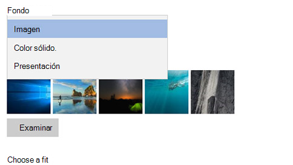

# Cambiar el fondo de escritorio y los colores

Para cambiar la configuración de colores, vaya a **Inicio** > de los**colores**de**Personalización** > de la**configuración** > y elija su propio color o deje que Windows extraiga un color de énfasis del fondo.

Para cambiar el fondo de escritorio, vaya a **Inicio** > de**Personalización** > de**configuración** > y, a**continuación, elija**una imagen, un color sólido o cree una presentación de imágenes. 

¿Desea más fondos y colores de escritorio? Visita [Microsoft Store](https://www.microsoft.com/store/collections/windowsthemes) para elegir entre docenas de temas gratuitos.
