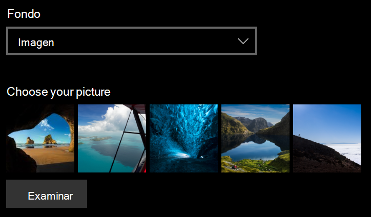

# Cambiar el fondo de la pantalla de bloqueo

- Vaya a la **pantalla de bloqueo**de**Personalización** >de **configuración** > . O haga clic o pulse [aquí](ms-settings:lockscreen?activationSource=GetHelp).

- Para establecer una imagen de fondo personalizada, seleccione **imagen** en la lista desplegable **fondo** y elija o **vaya** a la imagen.

  

- Para configurar una presentación de imágenes personalizadas, seleccione **presentación** en la lista desplegable **fondo** y elija un álbum o agregue una carpeta que contenga las imágenes de la presentación.

  
