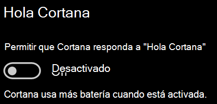

# Cortana no me habla o no me escucha

Si intenta usar la característica "Hola Cortana", que le permite comunicarse con Cortana sin seleccionar el botón de Cortana en la barra de tareas o el botón del micrófono en el panel de Cortana, confirme que la característica está habilitada:

1. Vaya a **Inicio** y seleccione **[Configuración > Cortana](ms-settings:cortana?activationSource=GetHelp)**.
2. En **Hola Cortana**, cambie el conmutador **Permitir a Cortana responder cuando digas "Hola Cortana"** a **Activado**.

**¿Su configuración de privacidad impide que Cortana le escuche?**

La configuración de privacidad puede impedir que Cortana responda a su voz.
- Asegúrese de que el reconocimiento de voz en línea está activado:
    - Vaya a **Inicio** y haga clic en **[Configuración > Privacidad > Voz](ms-settings:privacy-speech?activationSource=GetHelp)**.
    - En **Reconocimiento de voz en línea**, cambie la configuración a **Activado**.
- Asegúrese de que Cortana tiene permiso para acceder al micrófono. 
    - Vaya a Inicio y haga clic en **[Configuración > Privacidad > Micrófono](ms-settings:privacy-microphone?activationSource=GetHelp)**.
    - En **Elegir qué aplicaciones pueden acceder al micrófono**, busque ** Cortana** en la lista de aplicaciones y servicios, y asegúrese de que el conmutador está en **Activado**.

Además, asegúrese de que los altavoces o micrófonos estén encendidos y en funcionamiento para hablar con Cortana.
