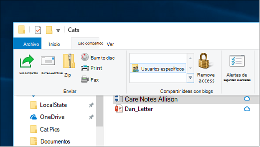

# Uso compartido de archivos en una red en Windows 10File sharing over a network in Windows 10

**Nota**: si anteriormente usó grupo en el hogar para compartir archivos, tenga en cuenta que el grupo en el hogar se ha quitado de Windows 10 (versión 1803).**Note**: If you previously used HomeGroup for file sharing, please note that HomeGroup has been removed from Windows 10 (Version 1803). Ahora puede compartir impresoras y archivos con las características integradas de Windows 10.You can now share printers and files by using built-in features in Windows 10.

**Para compartir archivos o carpetas a través de una red****To share files or folders over a network**

- En **el explorador de archivos**, seleccione un archivo > haga clic en la ficha **compartir** situada en la parte superior > en la sección **compartir con** , haga clic en **personas específicas**.In **File Explorer**, select a file > click the **Share** tab at the top > in the **Share with** section, click **Specific people**.

    
          
- Si selecciona varios archivos a la vez, puede compartirlos todos de la misma manera.If you select multiple files at once, you can share them all in the same way. También funciona con carpetas.It works for folders, too.

**Para ver los dispositivos de la red que están compartiendo archivos****To see devices on the network that are sharing files**

- En el **Explorador de archivos**, vaya a **red**.In **File Explorer**, go to **Network**. Si la detección de redes no está habilitada, verá un mensaje de error "la detección de red está desactivada..."If Network discovery is not enabled, you will see an error message "Network discovery is turned off..."

- Haga clic en el banner la **detección de red está** desactivada y, a continuación, en **activar la detección de redes y el uso compartido de archivos**.Click the **Network discovery is turned off** banner, then click **Turn on network discovery and file sharing**.

    

[Obtenga más información sobre el uso compartido de archivos en una redRead more about file sharing over a network](https://support.microsoft.com/help/4092694/windows-10-file-sharing-over-a-network)

[Compartir archivos con aplicaciones, OneDrive, mensajes de correo electrónico y mucho másShare files using apps, OneDrive, emails, and more](https://support.microsoft.com/help/4027674/windows-10-share-files-in-file-explorer)
