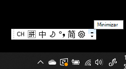

# Ocultar, mostrar o restablecer la barra de idiomaHide, display, or reset the language bar

**Para minimizar la barra de idioma:****To minimize the language bar:**

Puede hacer clic en el botón minimizar en la esquina superior derecha de la barra de idioma.You can click the minimize button on the top right corner of the language bar. También puede arrastrar la barra de idioma a la barra de tareas, lo que la minimizará automáticamente.Or, you can just drag the language bar to the task bar, which will automatically minimize it.

**Para mostrar la barra de idioma:****To pop out the language bar:**

Si no quiere acoplar la barra de idioma a la barra de tareas, haga clic con el botón derecho en cualquier espacio vacío de la barra de tareas y desactive la casilla **Barra de idioma** en el menú Barras de herramientas.If you don't want to dock the language bar in the taskbar, right-click any empty space in the taskbar, and uncheck the **Language bar** option in the Toolbars menu. De este modo, la barra de idioma se mostrará fuera de la barra de tareas, de la misma manera que en la captura de pantalla anterior.This will make the language bar appear outside the taskbar, just like the previous screenshot.

**Para restaurar la barra de idioma a los ajustes predeterminados:****To restore the language bar to default:**

Haga clic con el botón derecho en el botón idioma en la barra de herramientas y haga clic en **Restaurar la barra de idioma** en el menú.Right-click the language button in the toolbar, and click **Restore the language bar** option in the menu. De este modo, se restaurará a los ajustes predeterminados.This will restore it to default.

