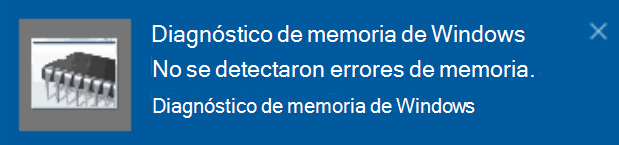

# Ejecutar el Diagnóstico de memoria de Windows en Windows 10Run Windows Memory Diagnostics in Windows 10

Si Windows o las aplicaciones de su PC se bloquean, dejan de funcionar o actúan de forma inestable, es posible que tenga un problema con la memoria de su PC (RAM).If Windows and apps on your PC are crashing, freezing, or acting in an unstable manner, you may have a problem with the PC’s memory (RAM). Puede ejecutar el Diagnóstico de memoria de Windows para comprobar si hay problemas con la memoria RAM de su PC.You can run the Windows Memory Diagnostic to check for problems with the PC’s RAM.

En el cuadro de búsqueda de la barra de tareas, escriba **Diagnóstico de memoria** y seleccione **Diagnóstico de Memoria de Windows**.In the search box on your taskbar, type **memory diagnostic**, and then select **Windows Memory Diagnostic**. 

Para ejecutar el diagnóstico, es necesario reiniciar el equipo.To run the diagnostic, the PC needs to restart. Puede reiniciar inmediatamente (si lo hace, guarde primero su trabajo y cierre los mensajes de correo y documentos abiertos) o programar el diagnóstico para que se ejecute automáticamente la próxima vez que se reinicie el equipo:You have the option to restart immediately (please save your work and close open documents and e-mails first), or schedule the diagnostic to run automatically the next time the PC restarts:

Tras reiniciar, la **herramienta Diagnóstico de Memoria de Windows** se ejecutará automáticamente.When the PC restarts, the **Windows Memory Diagnostics Tool** will run automatically. El estado y el progreso se mostrarán a medida que se ejecuta el diagnóstico. Si lo desea, puede cancelar el diagnóstico pulsando la tecla **ESC** en el teclado.Status and progress will be displayed as the diagnostics run, and you have the option of cancelling the diagnostics by hitting the **ESC** key on your keyboard.

Cuando finalice el diagnóstico, Windows se iniciará normalmente.When the diagnostics are complete, Windows will start normally.
Nada más iniciarse, cuando aparezca el escritorio, verá una notificación (situada junto al icono del **Centro de actividades** de la barra de tareas) que le indicará si se encontraron errores de memoria.Immediately after restart, when the Desktop appears, a notification will appear (next to the **Action Center** icon on the taskbar), to indicate whether any memory errors were found. Por ejemplo:For example:

Este es el icono del Centro de actividades:Here's the Action Center icon:  

Y una notificación de muestra:And a sample notification: 

Si no llegó a ver la notificación, seleccione el icono del **Centro de actividades** en la barra de tareas para mostrar el **Centro de actividades**. Allí, verá una lista desplegable con todas las notificaciones.If you missed the notification, you can select the **Action Center** icon  on the taskbar to display the **Action Center** and see a scrollable list of notifications.

Para revisar información detallada, escriba **evento** en el cuadro de búsqueda de la barra de tareas y, a continuación, seleccione **Visor de eventos**.To review detailed information, type **event** into the search box on your taskbar, and then select **Event Viewer**. En el panel izquierdo del **Visor de eventos**, vaya a **Registros de Windows >** Sistema.In the **Event Viewer**’s left-hand pane, navigate to **Windows Logs > System**. En el panel derecho, desplácese por la lista sin perder de vista la columna **Origen**, hasta que vea eventos cuyo valor de Origen sea **MemoryDiagnostics-Results**.In the right-hand pane, scan down the list while looking at the **Source** column, until you see events with Source value **MemoryDiagnostics-Results**. Si marca uno de esos eventos, verá la información del resultado en el cuadro de la pestaña **General** situado debajo de la lista.Highlight each such event and see the result information in the box under the **General** tab below the list.
