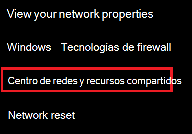
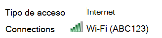

# Ver la contraseña de red Wi-Fi en Windows 10View Wi-Fi network password in Windows 10

1. Asegúrate de que tu PC con Windows 10 esté conectado a la red Wi-Fi.Make sure your Windows 10 PC is connected to the Wi-Fi network.

2. Vaya a **configuración > red & el estado de > de Internet**o haga clic o pulse [aquí](ms-settings:network?activationSource=GetHelp) para dejar que se le lleve ahora.Go to **Settings  > Network & Internet  > Status**, or click or tap [here](ms-settings:network?activationSource=GetHelp) to let us take you there now.)

3. Haga clic en **Centro de redes y recursos compartidos**.Click **Network and Sharing Center**.

    

4. En **centro de redes y recursos compartidos**, junto a **conexiones**, verá el nombre de su red inalámbrica.In **Network and Sharing Center**, next to **Connections**, you will see the name of your wireless network. Por ejemplo, si la red se denomina "ABC123", es posible que vea:For example, if your network is named "ABC123," you might see:

    

    Haga clic en el nombre de la red inalámbrica para abrir la ventana Estado de Wi-Fi.Click the wireless network name to open the Wi-Fi Status window. 

5. En la ventana Estado de Wi-Fi, haga clic en **propiedades inalámbricas**, haga clic en la pestaña **seguridad** y seleccione **Mostrar caracteres**.In the Wi-Fi Status window, click **Wireless Properties**, click the **Security** tab, and check **Show characters**.

    

